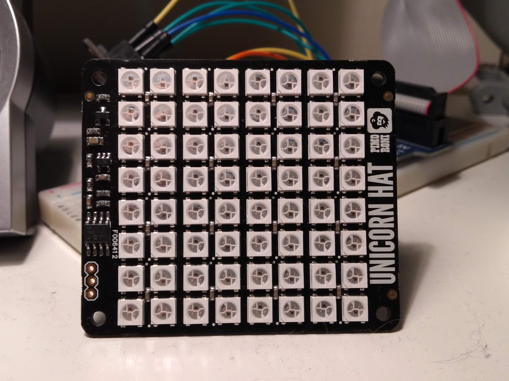

The PyClock is a hardware and software project. Today, I want to focus on the hardware.

### The Brain

The first, and arguably, most important piece of hardware used for the PyClock2 is the Raspberry Pi. For development purposes, I'm currently using a Pi 3 Model B. The final piece of hardware will be running on a Pi Zero-W. I'll delve into the reasons I'm using a higher spec board for development in a later post. The Raspberry Pi is the brains of the machine, and allows for easy prototyping. A Raspberry Pi packs a **lot** of features onto a tiny circuit board, but it doesn't have _everything_ you might expect from a full-sized computer.

### The Heart

One of those things is a real-time clock. The Raspberry Pi relies on pinging a Network Time Protocol on boot to figure out what time it is. This might prove to be a problem if I go travelling with my clock, and don't have wi-fi available to connect to. After much research, I chose to go with the Adafruit PiRTC, a preassembled add-on based on the PCF8523 RTC.

### The Face

The last piece of the puzzle was the Pimoroni Unicorn HAT. One can't very well have a picture clock without pictures, and the device needed to be releatively self-contained. The 8x8 RGB light grid provided by the Unicorn seemed to be just enough to be able to render simple pictures that a toddler could understand.

With that, I had the three components needed to build the PyClock.  Next time, I'll discuss the original PyClock.