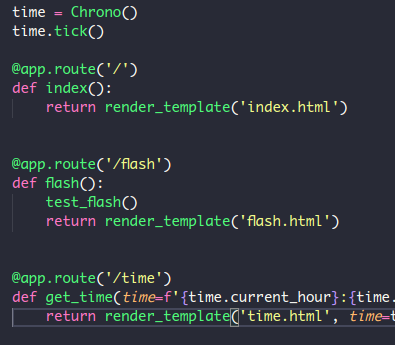
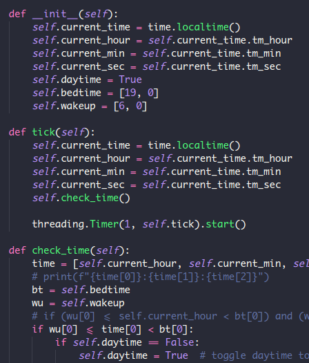

After a few months on the back burner (thanks to a few reminders from my daughter), I'm back to focusing on the PyClock 2. Now's as good a time as ever to delve into what makes the clock *tick*.

The original PyClock source code is little more than a script that is always running. I want the PyClock 2 to be configurable through a web-based interface. In keeping with the spirit of doing this project in Python, I chose to use Flask as the framework for my clock's user interface. Flask's lightweight nature was attractive, considering the target hardware for this project is a Raspberry Pi Zero W.

So far, the Flask app is a series of mostly experimental endpoints, and some setup code to get the clock running. The `/flash` endpoint was to establishing that I could manipulate the lightboard with HTTP requests.

The Clock class is the most important piece of this puzzle, and I wanted it to be a marked improvement over [the original](https://github.com/jdorety/picture.clock/blob/master/WakeUp/main.py). One of my main goals for this upgrade is to allow displays for holidays that aren't necessarily on the same calendar date every year (e.g. Thanksgiving, Easter, etc.). I'm hoping to leverage Python's calendar modules (and possibly others that I might find) to achieve this goal.

As for the basic clock mechanism, it's straight from the Pimoroni example code included in the [Unicorn HAT GitHub repo](https://github.com/pimoroni/unicorn-hat/blob/master/examples/hat/clock.py). It is much nicer on the CPU than my original code from two years ago.

Next up, I plan on creating a Display class, in keeping with my object oriented approach. My hope is that keeping hardware-specific functionality confined to well-designed class methods will aid in the overall organization of my codebase.