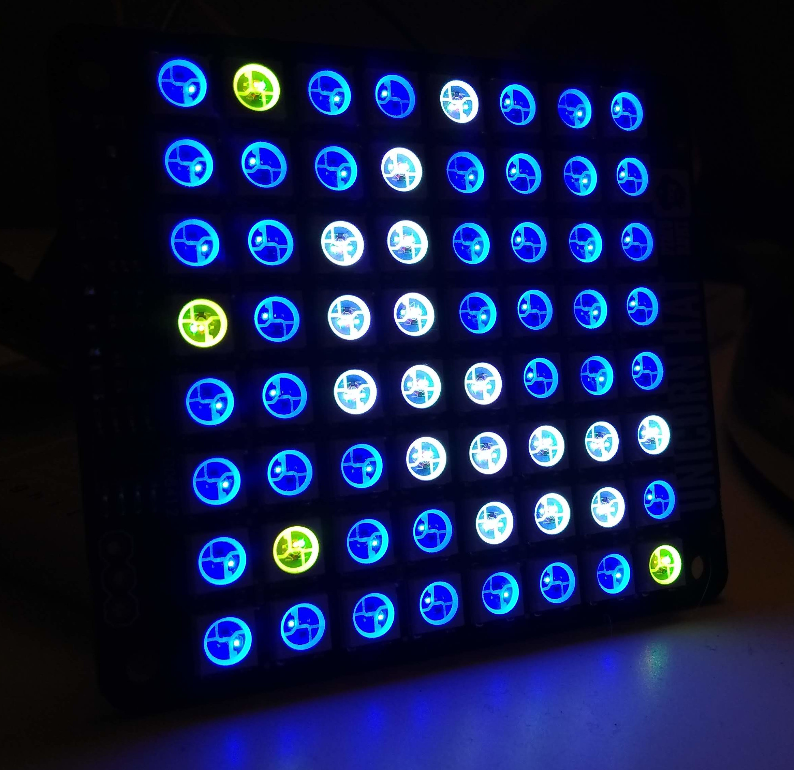

Software development has always been something I've been interested in. As a freshman in college, I declared my intended major to be Computer Science. That didn't work out for me. I ended up spending some time in the filmmaking world, and then I went to culinary school at my community college, and started a career in kitchens.

I had a great time as a cook; but once my daughter was born, I had to reprioritize my life, to say the least. So, I started looking into other career fields, and ended up right back at software development. The idea of going back to school was pretty daunting, and I wasn't really sure I wanted to attempt the regular college approach again anyway.

#### The Journey Begins...

So, I decided I'd teach myself. After all, the internet has opened up access to a staggering amount of resources. And a lot of it was free, or at least releatively inexpensive. I snapped up every Humble Book Bundle that came along that had anything to do with coding.

Also, around this time, I got a Raspbery Pi 2, and started messing around with it, following along with various project tutorials. After a while, I ran out of interesting things to do, and set it aside.

#### Linux Lights a fire

While making things with my Raspberry Pi, I ended up using Raspian a lot, which is the official operating system for the little computer. It's a Debian-based Linux distrubtion, and it was the straw that broke the camel's back. Without realizing it, I was constantly looking up tutorials on how to do things in Linux, and one day, I decide maybe I could use it on my regular computer, instead of Windows.

I challenged myself to install Linux Mint, and then learn to use it for everything I usually did on the computer (excepting a wide swath of games, but that's what dual-booting is for). I was amazed at how far Linux had come since I had first experimented with it back in the early 'aughts. Soon, I was using Linux almost exclusively, which was feeding my curiosity about computers.

This curiosity lead to several attempts at learning Python, which I had decided was the best programming language for me to start with. I got about a third of the way through two books, and one video lecture series, but would stall out and stop going through the material.

#### Please Go Back To Bed

Eventually, I took stock of myself, and came up with some strategies for breaking through the wall that had gotten in the way of my dreams of becoming a developer. One of those strategies was to build a Raspberry Pi project that didn't have a ready-made tutorial to follow.

Thankfully, my daughter, who was now a toddler, helped me out. She was at the age where she had a bed, but had no concept of time. So, she'd come in our bedroom at all hours, thinking it was time to get up, even if it was 3 in the morning. Her room was in the shade of a large tree and high bushes, so it was always pretty dark in there.

And then I had it! I could make a clock that would display a picture of the moon when it was time for her to stay in her room, and a sun when it was time to get up. I began reading a new book: **The Self-Taught Programmer: The Definitive Guide to Programming Professionally** by Cory Althoff.  Things started making more sense.  I began to understand how I could use Python's tools to make the clock I wanted.  I wrote a very basic script that would keep track of the computer's time, and log out messages at certain times of day.

I didn't know it at the time, but that was the moment when I finally got enough momentum to really begin my journey in software development in earnest.  I've been going ever since, and the posts that follow will focus on that project that got me started, the Picture Clock.  I've since renamed it twice, but those are stories for other posts.

